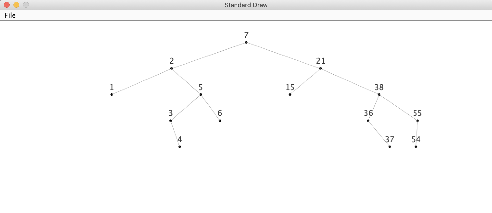

# Searching

## ST - Symbol Table

### Conventions

* One Key - One Value
* New value replace old when the existing key is used
* Null key do not allowed
* get() for non existing key - returns null
* set(key, null) equals delete(key)

### BST Basic visualization
See `searching.st.STBinarySearchTree.visualize()`

