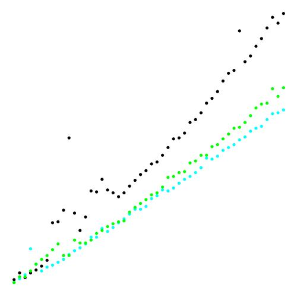

# Sorting


## Elementary Sorting comparison
Using the SortCompare.java

```
SELECTION (  Black)	|	0.000400	|	0.004500	|	0.014700	|	0.048000	|	0.075500	|	0.149400	
INSERTION (   Cyan)	|	0.000200	|	0.002700	|	0.011800	|	0.031000	|	0.061100	|	0.127500	
    SHELL (  Green)	|	0.000000	|	0.000300	|	0.001100	|	0.000600	|	0.001100	|	0.002100
```       


## Shell and Merge Downstream sorting comparison

```
           SHELL (  Black)
MERGE_DOWNSTREAM (   Cyan) - Merge Downstream (do not copy addition array, just swap during recursive call)  
MERGE_WITH_SHELL (  Green) - Merge Downstrean (copy values for each iteration) and use Shell sort for small chunks 
```

