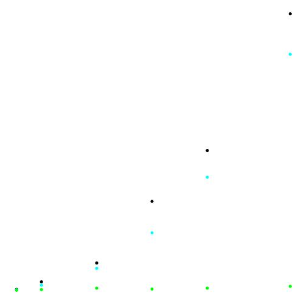

# Sorting


## Elementary Sorting Comparison
Using the SortCompare.java

```
SELECTION (  Black)	|	0.000400	|	0.004500	|	0.014700	|	0.048000	|	0.075500	|	0.149400	
INSERTION (   Cyan)	|	0.000200	|	0.002700	|	0.011800	|	0.031000	|	0.061100	|	0.127500	
    SHELL (  Green)	|	0.000000	|	0.000300	|	0.001100	|	0.000600	|	0.001100	|	0.002100
```       


