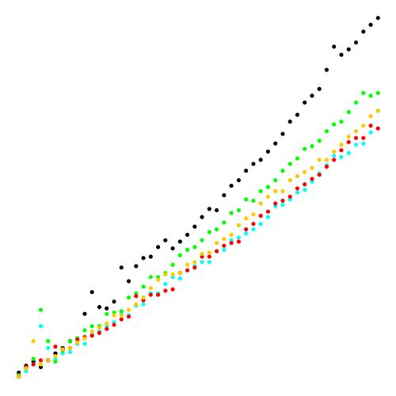

# Sorting


## Elementary Sorting comparison
Using the SortCompare.java

```
SELECTION (  Black)	|	0.000400	|	0.004500	|	0.014700	|	0.048000	|	0.075500	|	0.149400	
INSERTION (   Cyan)	|	0.000200	|	0.002700	|	0.011800	|	0.031000	|	0.061100	|	0.127500	
    SHELL (  Green)	|	0.000000	|	0.000300	|	0.001100	|	0.000600	|	0.001100	|	0.002100
```       


## Shell and Merge Downstream sorting comparison

```
                       		|	100	|	1100	|	2100	|	3100	|	4100	|	5100	|	6100	|	7100	|	8100	|	9100	|	10100	|	11100	|	12100	|	13100	|	14100	|	15100	|	16100	|	17100	|	18100	|	19100	|	20100	|	21100	|	22100	|	23100	|	24100	|	25100	|	26100	|	27100	|	28100	|	29100	|	30100	|	31100	|	32100	|	33100	|	34100	|	35100	|	36100	|	37100	|	38100	|	39100	|	40100	|	41100	|	42100	|	43100	|	44100	|	45100	|	46100	|	47100	|	48100	|	49100	
          SHELL  (  Black)	|	0.000200	|	0.000450	|	0.000600	|	0.000400	|	0.000650	|	0.000900	|	0.001100	|	0.001350	|	0.001450	|	0.002350	|	0.003150	|	0.002600	|	0.002550	|	0.002800	|	0.004050	|	0.003550	|	0.004100	|	0.004400	|	0.004450	|	0.004800	|	0.005050	|	0.004750	|	0.005000	|	0.005250	|	0.005550	|	0.005900	|	0.006200	|	0.006150	|	0.006700	|	0.007050	|	0.007250	|	0.007600	|	0.007850	|	0.008000	|	0.008300	|	0.008600	|	0.008950	|	0.009400	|	0.009650	|	0.010100	|	0.010350	|	0.010600	|	0.011300	|	0.012150	|	0.011850	|	0.012050	|	0.012300	|	0.012700	|	0.012950	|	0.013200	
MERGE_DOWNSTREAM (   Cyan)	|	0.000050	|	0.000250	|	0.000500	|	0.001900	|	0.001100	|	0.000700	|	0.000900	|	0.000950	|	0.001250	|	0.001250	|	0.001600	|	0.001700	|	0.001900	|	0.002050	|	0.002350	|	0.002300	|	0.002650	|	0.002700	|	0.003100	|	0.003100	|	0.003450	|	0.003700	|	0.003650	|	0.003950	|	0.004100	|	0.004250	|	0.004250	|	0.004650	|	0.004700	|	0.005050	|	0.005150	|	0.005300	|	0.005450	|	0.005650	|	0.005900	|	0.006300	|	0.006350	|	0.006550	|	0.006800	|	0.006900	|	0.007200	|	0.007500	|	0.007800	|	0.008150	|	0.008100	|	0.008250	|	0.008550	|	0.008600	|	0.009000	|	0.009800	
MERGE_DOWN_COPY  (  Green)	|	0.000100	|	0.000350	|	0.000700	|	0.002500	|	0.001350	|	0.000600	|	0.001000	|	0.001350	|	0.001450	|	0.001750	|	0.001900	|	0.001900	|	0.002350	|	0.002400	|	0.002450	|	0.002950	|	0.003100	|	0.003350	|	0.003700	|	0.003700	|	0.003850	|	0.004150	|	0.004500	|	0.004700	|	0.004800	|	0.005050	|	0.005350	|	0.005450	|	0.005700	|	0.006050	|	0.006150	|	0.006550	|	0.006500	|	0.006850	|	0.007000	|	0.007250	|	0.007600	|	0.007850	|	0.008050	|	0.008400	|	0.008500	|	0.008700	|	0.009050	|	0.009300	|	0.009400	|	0.009750	|	0.010100	|	0.010450	|	0.010350	|	0.010450	
MERGE_WITH_SHELL (    Red)	|	0.000050	|	0.000400	|	0.000500	|	0.000650	|	0.000650	|	0.001150	|	0.001050	|	0.001100	|	0.001400	|	0.001500	|	0.001550	|	0.001650	|	0.001800	|	0.001950	|	0.002150	|	0.002250	|	0.003000	|	0.002850	|	0.003050	|	0.003050	|	0.003200	|	0.003250	|	0.003850	|	0.003950	|	0.004050	|	0.004450	|	0.004450	|	0.004650	|	0.004850	|	0.004950	|	0.005000	|	0.005450	|	0.005650	|	0.005950	|	0.006100	|	0.006400	|	0.006500	|	0.006650	|	0.006950	|	0.007100	|	0.007300	|	0.007450	|	0.007750	|	0.008000	|	0.008350	|	0.008650	|	0.008800	|	0.008800	|	0.009250	|	0.009150	
       MERGE_UP  ( Orange)	|	0.000050	|	0.000350	|	0.001350	|	0.000500	|	0.000650	|	0.000800	|	0.001050	|	0.001100	|	0.001300	|	0.001450	|	0.001700	|	0.001850	|	0.002000	|	0.002300	|	0.002300	|	0.002500	|	0.002700	|	0.002950	|	0.003300	|	0.003600	|	0.003800	|	0.003800	|	0.003850	|	0.004150	|	0.004250	|	0.004550	|	0.004600	|	0.004950	|	0.005100	|	0.005250	|	0.005600	|	0.005850	|	0.006000	|	0.006400	|	0.006650	|	0.006850	|	0.006850	|	0.007250	|	0.007400	|	0.007550	|	0.007700	|	0.008000	|	0.008000	|	0.008300	|	0.008550	|	0.008850	|	0.009050	|	0.009250	|	0.009600	|	0.009800	
```


1. MERGE_DOWNSTREAM - `MergeDownstreamSorter` swap array and buffer array on each 
recursive level, so it allow us to not copy values each time after merging.
2. MERGE_DOWN_COPY - `MergeDownstreamCopySorter` the same as previous (p.1) but 
results of merging copied each time to source array. (Just to compare with p.1).
3. MERGE_UP - `MergeUpSorter` implemented without recursion. Execution time grows
as for all others Merge Sorting implementation (p.:1, 3, 4).
4. MERGE_WITH_SHELL - `MergeWithShellSorter` Use shell sorting for small arrays.
5. SHELL - `ShellSorter` Shell Sorting implementation of Insertion Sort.
